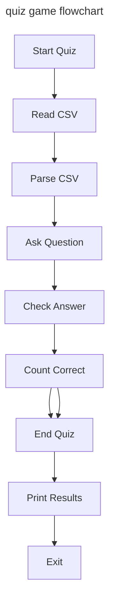

```mermaid
---
title: quiz game flowchart
---
flowchart TB
    A[Start Quiz] --> B[Read CSV]
    B --> C[Parse CSV]
    C --> D[Ask Question]
    D --> E[Check Answer]
    E --> F[Count Correct]
    F --> G[Next Question]
    F --> G[End Quiz]
    G --> H[Print Results]
    H --> I[Exit]

```